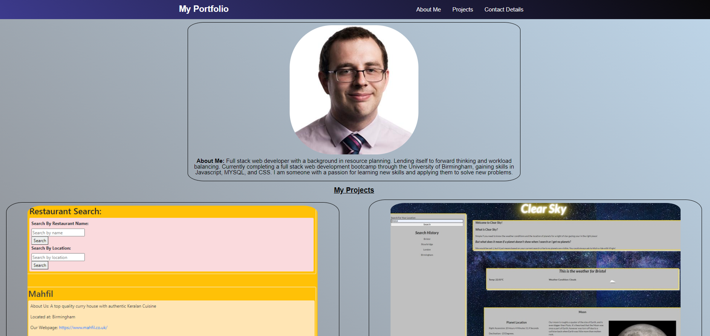

# My Portfolio

## Description

[Deployed here](https://cleggatron.github.io/Updated-Portfolio/)

This is my professional portfolio. As I have only recently started there are a lot of placeholder projects. These will be fleshed out with details of future projects, and I will update the order and precedence of the displayed work. 
The images are linked to the deployed projects, and there is a link to the code repositories, as well as details of the technology used below, allowing easy access to the most relevant codebases for prospective employers. 
Contact details have also been left as placholders for now, as I will finalise my professional email/telephone contact details.

## Installation
As this should just be a webpage there should not be installation required. The repo should be public for personal use/review.

## Usage

## License
Copyright (c) [2021] [David Clegg]

Permission is hereby granted, free of charge, to any person obtaining a copy of this software and associated documentation files (the "Software"), to deal in the Software without restriction, including without limitation the rights to use, copy, modify, merge, publish, distribute, sublicense, and/or sell copies of the Software, and to permit persons to whom the Software is furnished to do so, subject to the following conditions:

The above copyright notice and this permission notice shall be included in all copies or substantial portions of the Software.

THE SOFTWARE IS PROVIDED "AS IS", WITHOUT WARRANTY OF ANY KIND, EXPRESS OR IMPLIED, INCLUDING BUT NOT LIMITED TO THE WARRANTIES OF MERCHANTABILITY, FITNESS FOR A PARTICULAR PURPOSE AND NONINFRINGEMENT. IN NO EVENT SHALL THE AUTHORS OR COPYRIGHT HOLDERS BE LIABLE FOR ANY CLAIM, DAMAGES OR OTHER LIABILITY, WHETHER IN AN ACTION OF CONTRACT, TORT OR OTHERWISE, ARISING FROM, OUT OF OR IN CONNECTION WITH THE SOFTWARE OR THE USE OR OTHER DEALINGS IN THE SOFTWARE.